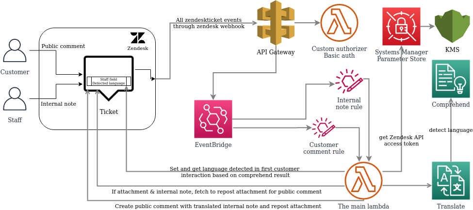

# Zendesk translation via aws eventbridge apigateway webhook
 <h3 align="center">Enable the power of AWS translation for zendesk tickets</h3>
 <h3 align="center"><a href="https://medium.com/daniel-wellington-tech-stories"></a><br /><a href="https://dev.to/dwtech"></a></h3>

This is a aws serverless solution to get translation for none english tickets in zendesk, both incoming and outgoing. If the language is detected wrong, the agent can easily change the language for the ticket inside of zendesk. <br /> <br />
    
What is the difference between this project and the other ones out there including the <a href="https://github.com/aws-samples/amazon-eventbridge-integration-with-zendesk">AWS zendesk+eventbridge sample</a>? This solution is more complete and is built on the actuall need from customer service agents (staff) as this replaced a (expensive) third party app. This was completed in april 2020 where most of other great contributions was released around that time. After running this in ~6 months in production with a dashboard from the first day to follow the cost and time saving we decided to release it. The following features was built to be able to move from the old solution:
  * First message is detecting the language and sets a custom field in zendesk so it is easy to change the language for the agents.
  * The agent/staff reply that should be translated is posted as a internal note started with #translate <text to be translated>. The update to the customer should be the same as agent/staff and not the API user.
  * If an attachment is also part of the internal note (eg return instructions) it will be part of the public reply response. <br /> <br />
 
 What is the difference between this solution and your other repo (<a href="https://github.com/dwtechnologies/zendesk-translation-via-aws-eventbridge-partner">zendesk-translation-via-aws-eventbridge-partner</a>)? This fork does not use the zendesk partner integration that requiers a subscription package from zendesk. Read more about this for details [here](#Why-not-using-eventbridge-partner-setup) <br /> <br />
 
With the solution we build, we managed to save 99.97% in running cost (OPEX), we also saved agent time (~45s per ticket update) because the translation was  automated. The old solution requierd the agents to request translation both for incoming and outgoing updates, while this solution already have the translation ready before the agents enters the case and also updates the ticket after translation is done. <br />
 
We could also ignore the OPEX cost for the this solution, you may ask your self why? The cost is now the same as the daily leasing ratefor our seven coffee machines in our HQ in Stockholm, Sweden. You may now think, what about development/initial cost (CAPEX)? The savings covered them the first six weeks.<br /> <br />

## Table of Contents
* [About the Project](#about-the-project)
  * [Built With](#built-with)
  * [Architecture](#architecture)
* [Getting Started](#getting-started)
  * [Prerequisites](#prerequisites)
  * [Deployment on AWS](#deployment-on-aws)
* [Usage](#usage)
* [Contributing](#contributing)
  * [Pull request wishlist](#pull-request-wishlist)
* [License](#license)
* [Contact](#contact)

## About The Project
### Built With
* [Zendesk](https://www.zendesk.com)
* [AWS Eventbridge](https://aws.amazon.com/eventbridge/)
* [AWS Lambda](https://aws.amazon.com/lambda/)
* [AWS Translate](https://aws.amazon.com/translate/)
* [AWS Comprehend](https://aws.amazon.com/comprehend/)
* [AWS Systems manager (Parameter Store)](https://aws.amazon.com/systems-manager/)
* [AWS SAM](https://aws.amazon.com/serverless/sam/)

## Architecture
<h3 align="center"></h3>

## Getting Started

### Prerequisites
#### Technical requierments
The following needs to be on your machine to be able to deploy
* git
* cat
* sam
* aws-cli

### Setup a custom field in zendesk
https://support.zendesk.com/hc/en-us/articles/203661496-Adding-custom-fields-to-your-tickets-and-support-request-form
Take a note on the ID as it will be set for ZendeskTicketLangFieldId

### Deployment on AWS
1. Clone the repo
```sh
git clone https://github.com/dwtechnologies/zendesk-translation-via-aws-eventbridge-apigateway-webhook.git
```
2. Edit the samconfig.toml to reflect your setup
```sh
stack_name              = "wh-zendesk-trans-dev"
s3_bucket               = "your-artifactory-bucket-dev"
s3_prefix               = "lambda/zendesk-translate-eventbridge-webhook-dev"
region                  = "eu-west-1"
```
4.1 Make sure to set the right region (same as the eventbridge), aws profile to use and artifact bucket to upload the lambda for deployment.
5. Edit parameters file 
6.1 Set the path that you created in "Setup zendesk api key" setep. Make sure that it is kms protected (secure string) or change CF + code.
```sh
ZendeskKeySSMParameterPath=/config/zendesk-translation/zendesk_api_key
```

3.2 The rest of the parameters, the subdomain does not need to 

```sh
	"Environment=dev",
	"DebugParam=true",
	"ZendeskKeySSMParameterPath=/config/zendesk-translation/zendesk_api_key",
	"ZendeskUsernameMail=zendesk-api-user-dev@domain.com",
	"ZendeskSubdomain=zendesk-subdomain",
	"ZendeskTicketLangFieldId=<ticketfield_id>",
	"KmsKeyId=kms_key_id_to_protect_ssm_parameters",
	"EventBusName=customer-eventbus-dev",
	"BasicAuthUsernameSSMParameterPath=/config/zendesk-translation/basicauth_username",
	"BasicAuthPasswordSSMParameterPath=/config/zendesk-translation/basicauth_password",
	"EventBusName=customer-eventbus-dev"

```
4. Deploy
```sh
sam build
sam depoy

#Example if you have multiple accounts with a aws cli dev and prod profile
sam deploy --profile dev --config-env default
sam deploy --profile prod --config-env production

```
### Setup zendesk outgoing webhooks
This needs to be done after the deployment have been done, take a note on the basic auth user and password and the ApiUrl output from the deployment (sam output or cloudformation console). Follow this guide to setup the <a href="https://github.com/dwtechnologies/zendesk-translation-via-aws-eventbridge-apigateway-webhook/blob/main/WEBHOOK_CONF_GUIDE.md">outgoing zendesk configuration</a>.
### Testing
I recommend to manually create a "catch all" / wildcard  eventbus rule to save the data to cloudwatch in the beginning to debug the communication going on the bus. To test the lambda, use the json files and adjust them to your needs  to test the lambda if you suspect that the lambda is not working as expected.

#### Tools
The <a href="https://github.com/spezam/eventbridge-cli/">eventbridge-cli</a> tool is really awesome and have saved allot of time during testing

## Contributing
Any contributions you make are **greatly appreciated** but please have in mind to make what you create must be dynamic to not break current use case

1. Fork the Project
2. Create your Feature Branch (`git checkout -b feature/AmazingFeature`)
3. Commit your Changes (`git commit -m 'Add some AmazingFeature'`)
4. Push to the Branch (`git push origin feature/AmazingFeature`)
5. Open a Pull Request

## Why not using eventbridge partner setup?
You need the "api package" subscription from zendesk, they basically bill you for not needing to setup webhooks. Is it a price question? No, we got our setup deleted (we participated in the beta) in production from no where by zendesk. After we escalated the support ticket to our account manager we got informed that this is a subscription based feature, we also thought that the attitude was not right and we did not get any info about this before or during the beta.<br />
Even if we were happy with the partner setup that was running for 6-7 months we started to build this setup instead as of the experience above.

### Todo
Remove the custom apigateway and lambda authorizer and use the new feature for <a href="https://aws.amazon.com/blogs/compute/using-api-destinations-with-amazon-eventbridge/">outgoing webhooks from eventbridge</a>

## License
Distributed under the GPL-3.0 License. See `LICENSE` for more information.

## Contact
Lezgin Bakircioglu - <a href="https://twitter.com/lerra82"></a> 
<a href="https://medium.com/@lerra82"></a> 
